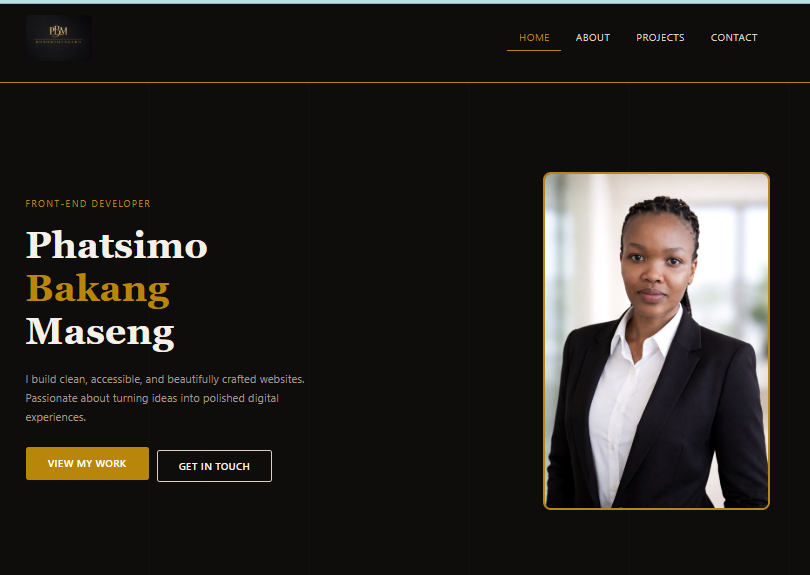
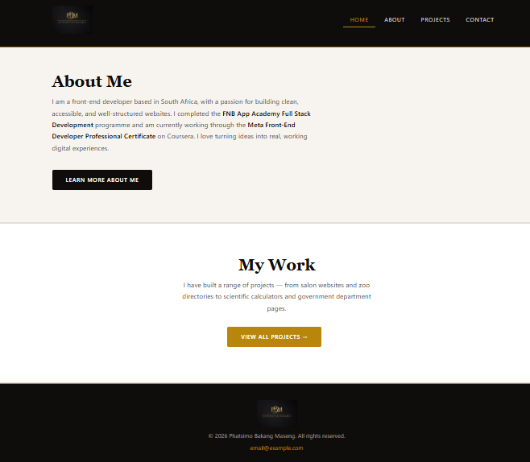
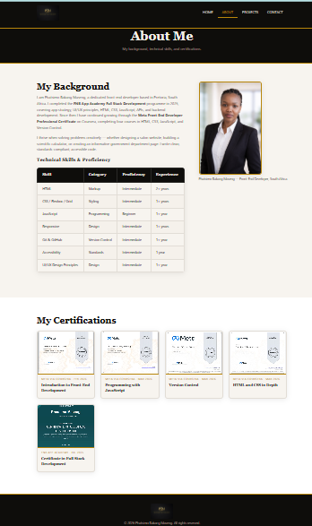
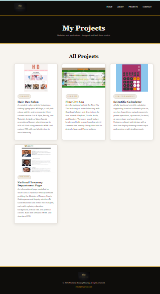
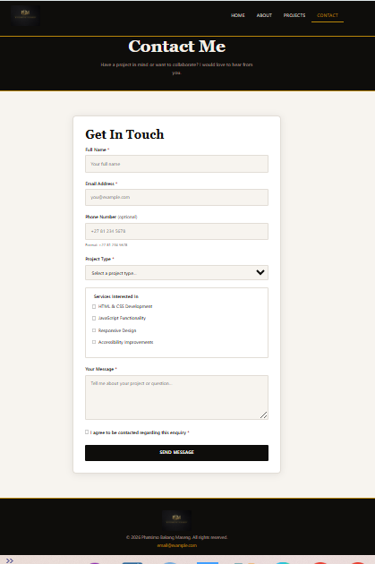
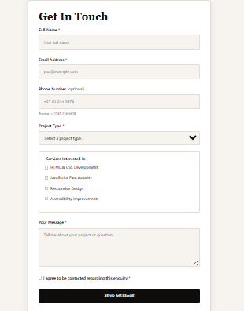
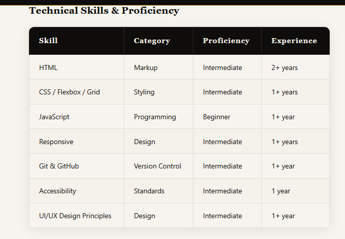
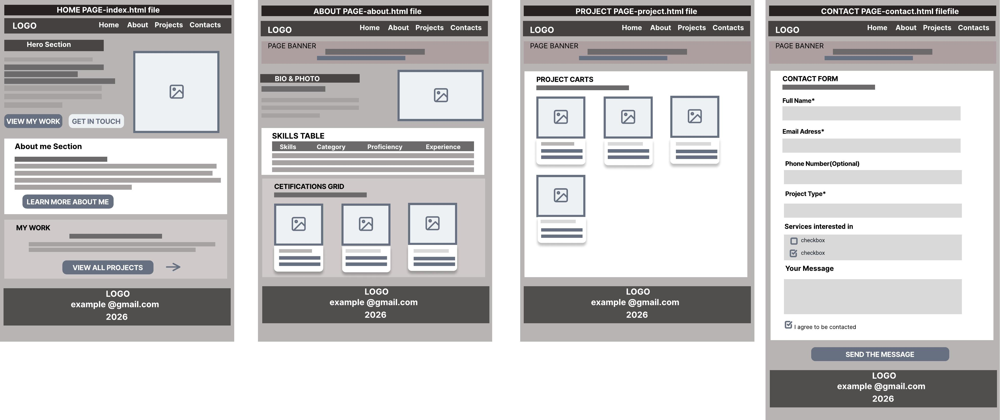

# Portfolio Website

A fully functional, accessible, and professionally styled multi-page portfolio website built with HTML and CSS. The project began from a buggy starter codebase (~70% complete with 41 intentional errors) and was debugged, completed, and enhanced to meet all capstone requirements.

---

## 1. Overview

This portfolio showcases my background as a front-end developer, my technical skills, my completed projects, and a contact form for potential collaborations. It is built using semantic HTML5, custom CSS with CSS custom properties, and Bootstrap 5 as a utility reset. The site has four pages: Home, About, Projects, and Contact.

---

## 2. Issues Found in the Starter Code

### HTML Issues (25 errors identified and fixed)

- All pages missing `lang="en"` on the `<html>` element - screen readers cannot detect page language
- All pages missing `<meta charset="UTF-8">` -character encoding was undefined
- All pages missing `<meta name="viewport">` - mobile layout was broken
- `
` used instead of semantic `<header>` on all pages
- `
` used instead of semantic `<footer>` on all pages
- No `<main>` element on any page - missing ARIA landmark region for screen readers
- Navigation entirely missing on `index.html`
- No `<nav>` element on any page - navigation not semantically marked
- Content sections used `
` instead of `<section>` throughout
- Project blocks used `
` instead of semantic `<article>`
- About page: no `<table>` existed at all
- Table missing `<thead>`, `<tbody>`, `<th scope>`, and `<caption>`
- All `` tags missing `alt` attributes
- Contact form had no `<label>` elements for any input
- Form only had text and textarea inputs - needed 5+ input types
- No HTML validation attributes (`required`, `minlength`, `pattern`) anywhere
- Grouped inputs lacked `<fieldset>` and `<legend>`
- No `aria-label`, `aria-current`, or `aria-required` on any element
- No `id` attributes to link labels to inputs
- No skip-to-main-content link for keyboard users
- Footer `text-align` was `left` instead of `centred`

### CSS Issues (16 errors identified and fixed)

- Only 2–3 selector types used - needed 5+
- No pseudo-classes (`:hover`, `:focus`, `:nth-child`) used anywhere
- No descendant selectors (e.g. `nav ul li a`)
- No ID selectors
- No pseudo-elements (`::before`, `::after`)
- Navigation styling completely absent
- Table styling completely absent
- Form styling incomplete - only `display:block` on inputs
- No box model demonstration (margin, padding, border)
- Font declared as `Arial` with no proper fallback stack
- No `:focus` styles - keyboard navigation inaccessible
- No hover transitions on interactive elements
- Inconsistent formatting and no logical organisation in the CSS file

---

## 3. Fixes Implemented

Every page now has `lang`, `charset`, `viewport`, and `description` meta tags. Replaced all `div.header` with `<header>` and `div.footer` with `<footer>`. Added `<nav>`, `<main>`, `<section>`, `<article>` throughout all pages. Added consistent navigation with 4 working links on all 4 pages. All images have descriptive alt text. Built a full skills table with `thead`, `tbody`, `th scope`, and `caption` on the About page. Contact form rebuilt with 5 input types (text, email, select, checkbox, textarea), every input has a label, and validation uses `required`, `minlength`, and `pattern`. Added a skip-to-content link on every page. Footer fixed to `text-align: center`.

CSS was rewritten using CSS custom properties. Added selector types including element, class, ID, descendant, pseudo-class, and pseudo-element. Added `:hover`, `:focus`, `:nth-child` on the skills table, and card hover animations. Full box model demonstrated. Navigation, table, and form are all fully styled.

---

## 4. HTML Structure & Semantic Choices

Every page follows this landmark structure: `<header>` with site logo and `<nav>`, `<main>` wrapping all page content, `<section>` for grouped content areas, `<article>` for self-contained blocks like project cards and the about grid, and `<footer>` for copyright and contact.

This structure ensures screen readers can navigate by landmark, search engines understand the content hierarchy, and the document outline is logical and consistent across all four pages.

---

## 5. CSS Styling Approach

CSS custom properties define the colour palette and typography, making the design easy to maintain. The stylesheet is organised into 16 labelled sections: Reset, Base Styles, Layout Helpers, Skip Link, Header & Navigation, Buttons, Hero Section, Page Banner, About Page, Data Table, Certifications, Projects, Contact Form, and Footer.

Selector types used: element (`body`, `h1`, `table`), class (`.project-card`, `.cert-card`), ID (`#main-nav`, `#site-logo`), descendant (`header .container`, `.skills-table thead`), attribute (`input[type="text"]`), and pseudo-class (`:hover`, `:focus`, `:nth-child`). Bootstrap is loaded for its utility resets, while all visual design is implemented in the custom `styles.css`.

---

## 6. Accessibility Improvements

- `lang="en"` added to all HTML elements
- Skip-to-main-content link added on every page
- `:focus` styles on all interactive elements (buttons, links, inputs)
- Semantic HTML landmarks for screen reader navigation
- Table `caption` and `th scope` added for data table accessibility
- `aria-label`, `aria-current`, and `aria-labelledby` used throughout

---

## 7. How to View Locally

1. Download or clone the repository to your computer.
2. Open the project folder in File Explorer (Windows) or Finder (Mac).
3. Double-click `index.html` - it will open in your default browser.
4. Use the navigation menu to move between pages. All links are relative so they work without a server.

---

## 8. Screenshots

### Home Page

---

### About Page

---

### Projects Page

---

### Contact Page

---

### Navigation (with active state highlighted)

---

### Contact Form (close-up)

---

### Technical Skills Table

---

### Wireframe — All 4 Pages

---

## 9. Reflection

The most challenging part was the CSS. The starter file had placeholder comments marked as errors, but many underlying declarations were structurally valid — the real problem was no selector variety, no pseudo-classes, no box model, and no layout system. Rebuilding around CSS custom properties made everything consistent and easy to scale.

On the HTML side, replacing generic `div` containers with semantic elements required careful attention to document structure and heading hierarchy. The accessibility work — skip links, ARIA attributes, focus styles, form labels — was the most rewarding, because it makes the site genuinely usable for everyone, not just mouse users.

I also added a certifications section, a professional hero design with a photo, and Bootstrap as a utility reset, which were improvements beyond the starter requirements. These are documented here so the assessor can see they were intentional additions, not accidental inclusions.
